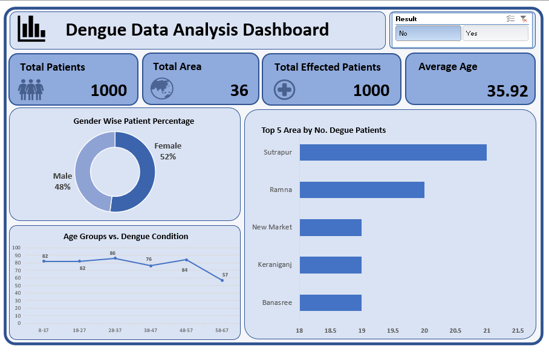

# Dengue Data Analysis Dashboard

An Excel-based interactive dashboard to analyze dengue patient data using **Power Query**, **pivot charts**, and **data visualization** techniques.

---

## Dashboard Preview

## Dashboard Preview

---

## Project Content

| File | Description |
|------|-------------|
| `Dengue_Dataset.xlsx` | Raw dataset containing patient details |
| `Dengue_Dataset_Report.xlsx` | Power Query cleaned data + dashboard |
| `Dengue_Data_Analysis_Dashboard.png` | Screenshot of the completed dashboard |

---

## Key Highlights

-  **Patients Analyzed:** 1000  
-  **Areas Covered:** 36  
-  **Confirmed Dengue Cases:** 533 
-  **Average Age:** 35.92 years  
-  **Gender Split:** 52% Female, 48% Male  
-  **Top Affected Areas:** Sutrapur, Ramna, New Market, Keraniganj, Banasree  
-  **Age Group Analysis** shows highest cases in 28–37 age range  

---

## Tools & Techniques Used

- **Excel Power Query** for data import and cleaning  
- **Pivot Tables & Pivot Charts** for dynamic insights  
- **Slicer** for filtering dengue-positive results  
- **Donut and Bar Charts** for gender and location breakdowns  

---

## How to Explore

1. Open `Dengue_Dataset_Report.xlsx` in Excel.
2. Use the slicer (top-right) to filter by positive/negative dengue results.
3. View key metrics, trends, and breakdowns across age and area.
4. Update or modify data using Power Query (refresh queries if needed).

---

### Built by SadiaHossain21 
